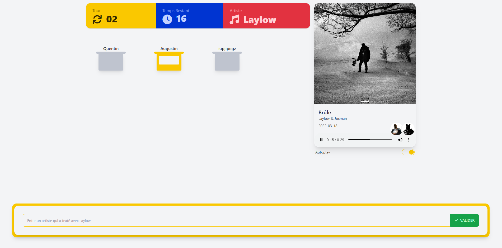
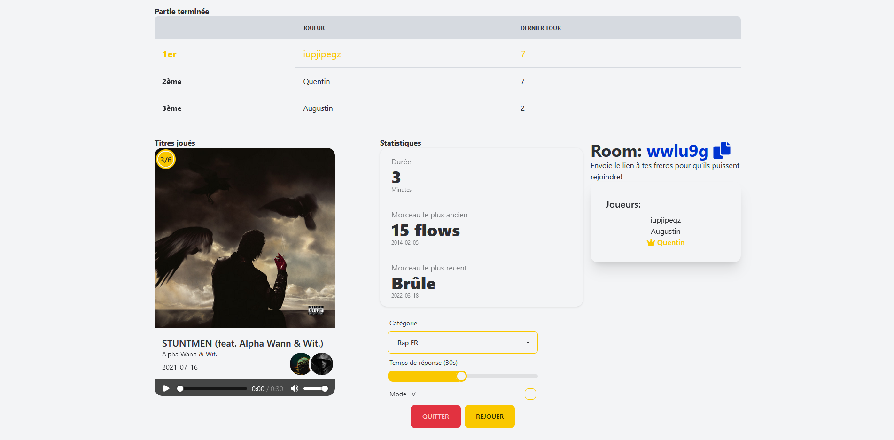

<h1 align="center" 
    style="background:#0034d3; border-radius:5px;">
    Roland Gamos⚡
<h1>

🎧 Le jeu du meilleur jeu rap au monde.

    Jusqu'à preuve du contraire.

# Sommaire
- [🗒️ Règles](#%EF%B8%8F-règles)
- [🖼️ Screens](#%EF%B8%8F-screens)
    - [🎵 En Jeu](#-en-jeu)
    - [🎧 Fin de partie](#-fin-de-partie)
- [⚖️ Droits](#%EF%B8%8F-droits)

---

# 🗒️ Règles

🎵 Le but du jeu ? Un ping-pong featuring musical.

🎙️ Un artiste de départ est pris dans la playlist de ton choix.

🎧 Chacun votre tour vous devrez donner un feat avec l'artiste précédent. 

⚠️ Un artiste ne peut être cité qu'une fois ! 

🥇 Que le meilleur gagne !

---

# 🖼️ Screens

## 🎵 En jeu 

## 🎧 Fin de partie 

---
# ⚖️ Droits

- Inspiré du rolang gamos créé rap jeu.
- Créé par [Augustin B.](https://github.com/augustinbegue) et [Quentin AM.](https://github.com/QuentinAM)
